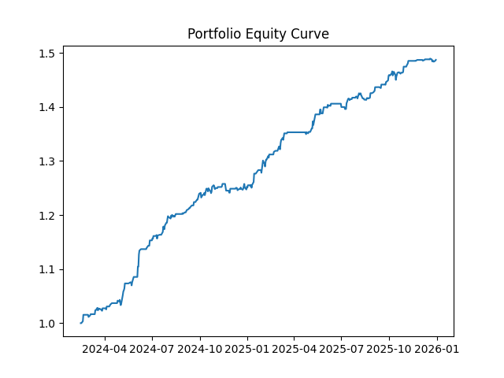
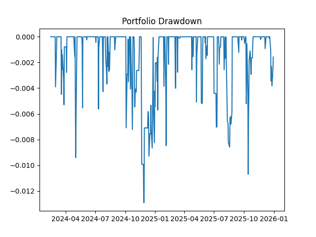
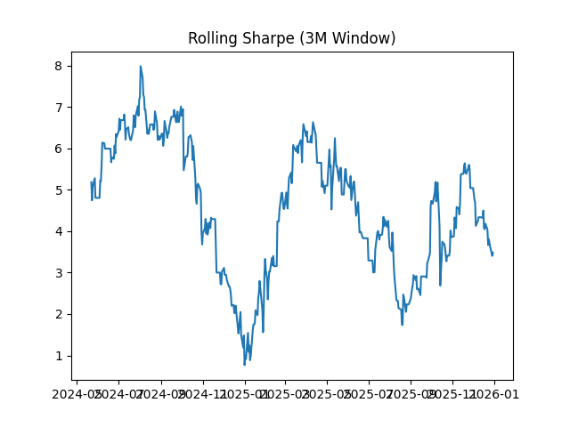
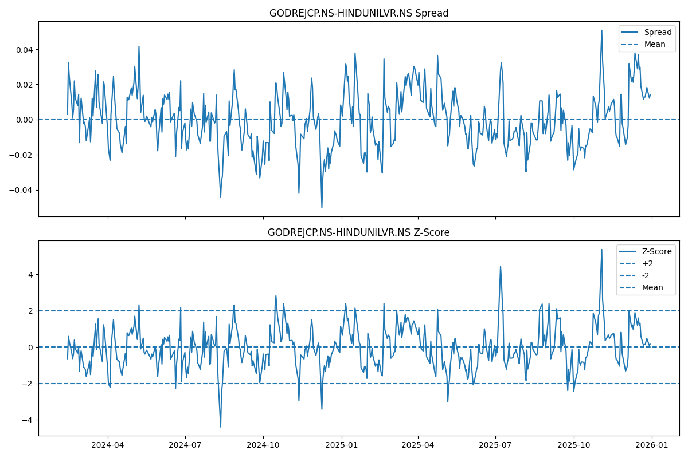

# Statistical Arbitrage Using Kalman Filter
### Dynamic Hedge Ratio Pairs Trading Strategy with Portfolio Construction
Statistical arbitrage pairs trading system using Kalman Filter for dynamic hedge ratio estimation, cointegration testing, and portfolio construction.

This project implements a **multi-sector statistical arbitrage strategy** using a Kalman Filter for dynamic hedge ratio estimation.

It scans NSE stocks, identifies cointegrated pairs, and constructs a mean-reversion portfolio with risk controls and transaction costs.

### Overview

This project implements a statistical arbitrage pairs trading system using a Kalman Filter to dynamically estimate hedge ratios between equity pairs. The strategy identifies cointegrated pairs across multiple sectors, generates mean-reversion signals using z-scores, and constructs an equal-weight portfolio of top-performing pairs.

Unlike static hedge ratio models, this approach uses time-varying parameter estimation, allowing the spread relationship between assets to adapt to changing market conditions.

The framework includes:

* Kalman filter–based dynamic hedge ratio estimation
* Stationarity and mean-reversion testing
* Train/test validation pipeline
* Signal generation with risk controls
* Portfolio construction from multiple pairs
* Performance analytics and visualization

### Why Kalman Filter?

Traditional pairs trading models use a static hedge ratio estimated via OLS, which assumes a stable relationship between assets.

However, in real markets, relationships between assets evolve over time. The Kalman Filter models the hedge ratio as a latent state that updates dynamically, allowing the spread to adapt to changing market regimes.

This leads to more robust signal generation and better handling of non-stationarity.

### Key Features

* Dynamic Hedge Ratio Estimation using Kalman Filter
* Spread Mean-Reversion Modeling
* ADF Test for Stationarity Validation
* Half-Life Estimation of Mean Reversion
* Z-Score Based Entry & Exit Signals
* Transaction Cost Modeling
* Train/Test Separation to Avoid Overfitting
* Multi-Sector Pair Scanning
* Portfolio Construction from Top Pairs
* Rolling Sharpe Ratio Analysis
* Live Signal Generation for Top Pair

### Strategy Workflow

#### Step 1 — Data Acquisition

Daily log-price data is downloaded using Yahoo Finance via:
* yfinance

Sectors scanned include:

* BANK NIFTY
* FIN NIFTY
* FMCG
* NIFTY AUTO
* NIFTY IT
* NIFTY METAL
* NIFTY PHARMA

#### Step 2 — Pair Selection

All possible stock pairs within each sector are generated.

For each pair:

1) Kalman filter estimates:
* Hedge ratio (β)
* Intercept (α)

2) Spread is computed:
* Spread = Asset_A − (β × Asset_B + α)

3) Stationarity check:
* Augmented Dickey-Fuller test
* Only stationary spreads retained

4) Mean reversion speed estimated:
* Half-life calculation

Pairs are filtered using:
* p-value < 0.05
* Half-life < 20
* Minimum number of trades
* Sharpe threshold

#### Step 3 — Signal Generation

Mean-reversion signals are generated using:
* Rolling mean and standard deviation
* Z-score normalization

Trading Logic:

The strategy exploits mean-reversion in the spread between two cointegrated assets.

| Condition | Action |
|----------|--------|
| Z-score > +2 | Enter Short Spread (Sell A, Buy B) |
| Z-score < -2 | Enter Long Spread (Buy A, Sell B) |
| Z-score returns within ±0.5 | Exit Position |
| Z-score > +3 or < -3 | Stop Loss |
| Holding Period > 10 days | Exit Position |

Risk Controls:
* Exit Z-score threshold
* Stop-loss boundary
* Maximum holding period

#### Step 4 — Backtesting

Strategy returns are computed using:
* Lagged hedge ratios
* Spread returns
* Transaction cost modeling

Performance Metrics:
* Sharpe Ratio
* Maximum Drawdown
* Number of Trades
* Equity Curve
* Rolling Sharpe

Train/test separation:
* Training: Before 2024
* Testing: After 2024

This prevents look-ahead bias.

#### Step 5 — Portfolio Construction

Top-performing pairs are selected and combined into an equal-weight portfolio.

Portfolio Metrics:
* Portfolio Sharpe Ratio
* Maximum Drawdown
* Cumulative Returns
* Rolling Sharpe Ratio
  
#### Step 6 — Live Signal Generation

For the top-performing pair:
* Latest z-score calculated
* Trading signal generated

Example output:

Live Signal:

GODREJCP.NS-HINDUNILVR.NS

Z-score: 0.1859

Position: 0

### Example Results

Top Performing Pairs:

| Pair	| Train Sharpe	| Test Sharpe	| Drawdown |
|-----|-------------|-------------|--------|
| GODREJCP–HINDUNILVR	| 1.87	| 2.87	| 0.022|
| ITC–COLPAL	| 1.01	| 1.51	| 0.034 |
| HDFCBANK–PFC	| 0.94	| 1.82	| 0.047 |

Portfolio Performance:

* Sharpe Ratio: 4.46
* Maximum Drawdown: -1.29%

The strategy demonstrates strong out-of-sample performance, indicating robustness and reduced overfitting due to strict train/test separation.

Portfolio Equity Curve



Portfolio Drawdown



Rolling Sharpe Ratio



Spread and Z-Score Example



### Project Structure
```
statistical_arbitrage_pairs_trading/

│
├── src/
│   ├── data.py
│   ├── model.py
│   ├── strategy.py
│   ├── backtest.py
│   ├── utils.py
│   ├── pair_selection.py
│   ├── portfolio.py
|   ├── plotting.py
│   └── __init__.py
│
├── results/
│   ├── final_pairs.csv
|   ├── rolling_sharpe.png
│   ├── equity_curve.png
|   ├── drawdown.png
|   └── GODREJCPNS_HINDUNILVRNS_spread_zscore.png
|   
├── config.py
├── main.py
├── requirements.txt
└── README.md
└──.gitignore
```

### Installation

Clone repository:

git clone https://github.com/yourusername/pairs-trading-kalman.git
cd pairs-trading-kalman

Install dependencies:

pip install -r requirements.txt

### Running the Project

Execute:

python main.py

This will:

1) Download historical data
2) Scan pairs
3) Backtest strategies
4) Build portfolio
5) Generate live signal
6) Plot results

### Dependencies

* numpy
* pandas
* yfinance
* statsmodels
* pykalman
* matplotlib

### Mathematical Model

#### Kalman Filter State Model

The hedge ratio evolves dynamically:

β_t = β_{t−1} + w_t

α_t = α_{t−1} + w_t

Observation equation:

A_t = β_t B_t + α_t + v_t

Where:

* β = hedge ratio
* α = intercept
* w_t = process noise
* v_t = observation noise

### Risk Management Features

* Transaction costs included
* Stop-loss threshold
* Maximum holding period
* Train/test validation
* Drawdown tracking

### Future Improvements

Potential extensions:

* Johansen cointegration testing
* Multi-pair portfolio optimization
* Regime detection models
* High-frequency data support
* Reinforcement learning–based signals
* Dynamic position sizing

### Applications

This framework can be extended to:

* Statistical arbitrage trading
* Market-neutral strategies
* Sector-relative value trading
* Portfolio diversification

### Author

Quantitative Trading Project

Focused on:

* Market Microstructure
* Statistical Arbitrage
* Algorithmic Trading Systems
